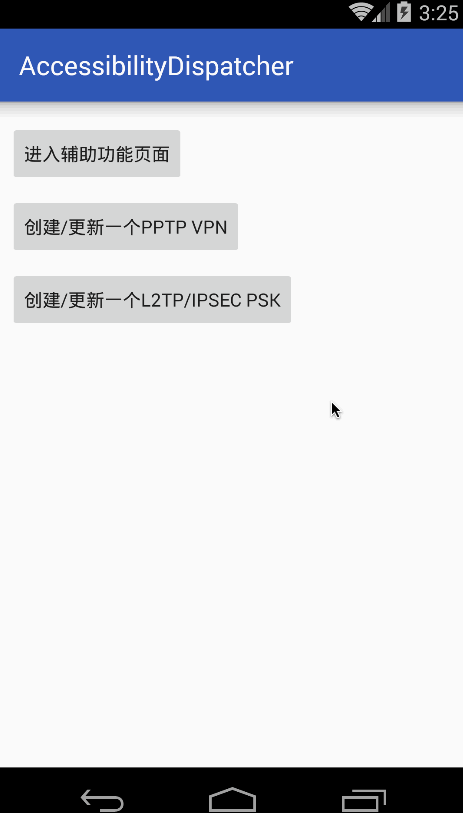
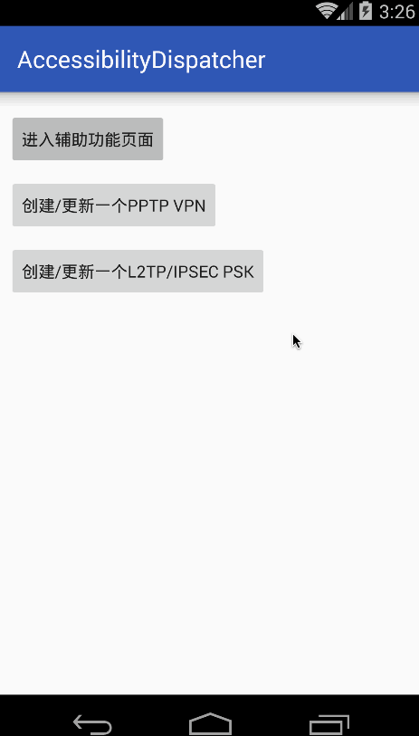
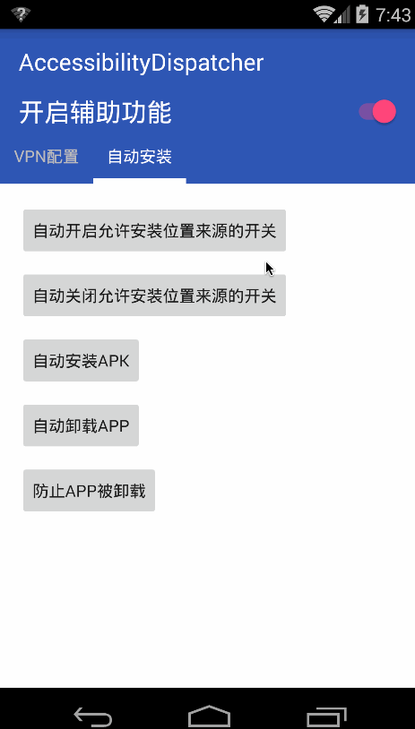

# 辅助功能分发器

主要实现各种功能的辅助点击，包括但不限：

* [自动配置VPN教程](https://github.com/zhitaocai/AccessibilityDispatcher/wiki/%E8%87%AA%E5%8A%A8%E9%85%8D%E7%BD%AEVPN)
* [自动开/关 允许安装未知来源](https://github.com/zhitaocai/AccessibilityDispatcher/wiki/%E8%87%AA%E5%8A%A8%E5%BC%80%E5%90%AF%E5%85%81%E8%AE%B8%E5%AE%89%E8%A3%85%E6%9C%AA%E7%9F%A5%E6%9D%A5%E6%BA%90)


## 效果图






## USAGE

### 下载

```gradle

compile 'io.github.zhitaocai:accessibilitydispatcher:0.2.0@aar'

// or
// 如果你的项目本身已经集成了 support-annotations 那么请移除本类库中本身所依赖的 support-annotations
compile ('io.github.zhitaocai:accessibilitydispatcher:0.2.0@aar') {
    exclude group: 'com.android.support', module: 'support-annotations'
}

```

### 具体使用

请移步至 [wiki](https://github.com/zhitaocai/AccessibilityDispatcher/wiki)


### 如何获取演示程序?

1. 下载项目后在项目根目录运行:
	```
	./gradlew :app:assembleRelease
	```
2. 生成的apk在 ``/static/apk``

## License

    Copyright 2017 Zhitao Cai

    Licensed under the Apache License, Version 2.0 (the "License");
    you may not use this file except in compliance with the License.
    You may obtain a copy of the License at

       http://www.apache.org/licenses/LICENSE-2.0

    Unless required by applicable law or agreed to in writing, software
    distributed under the License is distributed on an "AS IS" BASIS,
    WITHOUT WARRANTIES OR CONDITIONS OF ANY KIND, either express or implied.
    See the License for the specific language governing permissions and
    limitations under the License.